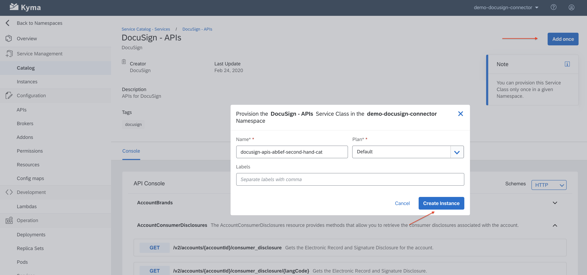
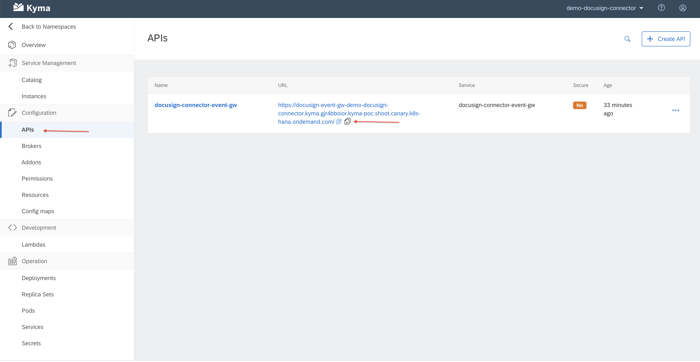
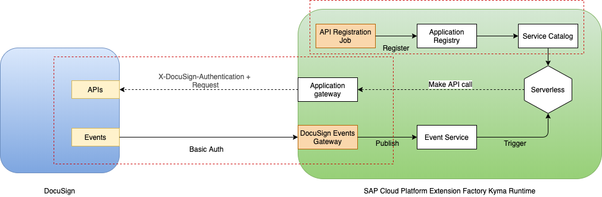

# Overview

A sample integration of [DocuSign](https://www.docusign.com/) with [Kyma](https://kyma-project.io) to demonstrate how Kyma can be leveraged to enable side-by-side extensibility flows for DocuSign when used with SAP applications such as SAP Service Cloud.

It uses a [DocuSign addons connector](./addons) to connect DocuSign with Kyma.

## Demo workshop

### What will be covered?
* Set up connectivity between DocuSign and Kyma
* Deploy an example lambda that
  * Is executed on DocuSign Envelope events
  * Makes API calls to DocSign

### Prerequisites

* DocuSign tenant.
* APIs and Keys already configured in DocuSign. We will be using `X-DocuSign-Authentication` based authentication to make API calls. Refer to this [documentation](https://developers.docusign.com/esign-soap-api/reference/Introduction-Changes/Authentication) for further details.
* DocuSign tenant URL to make API calls,  Username, password and Integrator Key are handy to be used later.
* A running Kyma instance

### Steps

* Create a new namespace in Kyma. We will be doing the whole workshop by deploying resources and workloads in this namespace.

* Navigate back to Kyma console main. Create a new Kyma application for connecting DocuSign. 
Think of `Kyma application` as a proxy for the actual DocuSign Tenant to which APIs and events connectivity will be achieved.
Next step is to bind the application to the namespace. By binding, we are essentially saying that workloads running in this namespace has access to data coming from this application (namely Events and APIs).

* Lets go back to our namespace.
Provision the addon. This addon will then provide us a connector that will be used to establish connectivity between Kyma and DocuSign.
For the URL, provide `git://https://github.com/abbi-gaurav/prototype-docusign-kyma//addons/index.yaml?ref=master`.
Once addon is deployed, the connector will be avaialble in `Catalog->addons`. 

* Provision the connector. Provide the details as required to make API calls to DocuSign.
Additionally provide the basic authentication details for the event gateway that will receive DocuSign events.

* Post provisioning, DocuSign APIs and events will be available in `Catalog->Services` section.
Add once both APIs and events.

* Lets configure the DocuSign to be able to send events to Kyma.
Kyma API has already been deployed as a part of the connector. It exposes an URL over internet that will receive DocuSign events and will forward it to Kyma.
Lets go ahead and configure this URL in DocuSign admin console.

* Lets take a minute to understand what we have acheived so far. We have now enable APIs and events connectivity with DocuSign. 
That implies, 
  * Workloads in Kyma (lambdas, microservices) can now be triggered with DocuSign events.
  * Lambdas and microservices from Kyma can make API calls to DocuSign.
 

* Lets take it to next part and write a lambda that 
  * will be triggered by a DocuSign event.
  * Make an API call back to DocuSign.

* Create a lambda, select event trigger. Use the [application code](./assets/lambda/demo-docusign-connector.js) and [npm dependencies](./assets/lambda/package.json).
Configure the Service binding that will enable making API calls back to DocuSign.

* In DocuSign, create a test envelope and sign it. The activity on DocuSign side will trigger the lambda and its logic will be executed.
You can check the lambda logs to see what is going.

* Next action items for you, 
  * Write your own lambda. Add logic as per your business scenario.
  * Integrate with other SAP systems and also third party systems.