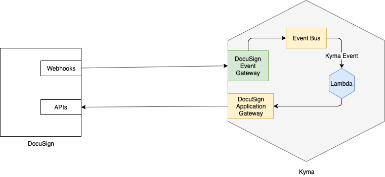

# Overview

A sample integration of [DocuSign](https://www.docusign.com/) with [Kyma](https://kyma-project.io) to demonstrate how Kyma can be leveraged to enable side-by-side extensibility flows for DocuSign when used with SAP applications such as SAP Service Cloud.

## Manual Setup

DocuSign APIs and events are registered manually for this prototype. 

>Note: For productive integrations, one should use the [application connector](https://kyma-project.io/docs/components/application-connector/#overview-overview) concept.

### PoC Architecture



### Prerequisites

* Kyma is up and running.

### Steps

* Clone this [repository](https://github.com/janmedrek/one-click-integration-script) containing script to generate certificates for communicating with a Kyma application.
* Create a new Application in Kyma Console (e.g. `docusign` )
* Copy the token
  * Navigate to the `Integration --> Applications --> docusign`
  * `Connect Application`
  * Copy the token to the clipboard
* Use the one-click-generation [helper script](https://github.com/janmedrek/one-click-integration-script) to generate the certificate

  ```shell script
  ./one-click-integration.sh -u <paste token here>
  ```
  This will generate a `generated.pem` file. This contains the signed certificate and key that we will use for subsequent communications.

  > **NOTE** The token is short-lived. So either hurry up or regenrate the token
* Set up console environment
  
  ```shell script
  export CLUSTER_DOMAIN="<kyma-cluster-domain>"
  export APP_NAME="docusign"
  ```

* Register DocuSign APIs to Kyma application.
  
  Enrich the [apis.json](./assets/apis.json) file with DocuSign 
  - `account id`
  - `username`
  - `password`
  - `integrator key`
  
     ```shell script
    curl -X POST -H "Content-Type: application/json" -d @./assets/apis.json https://gateway.${CLUSTER_DOMAIN}/${APP_NAME}/v1/metadata/services --cert ./assets/generated.pem -k
    ```
* Register DocuSign Events to Kyma application.

    ```shell script
    curl -X POST -H "Content-Type: application/json" -d @./assets/events.json https://gateway.${CLUSTER_DOMAIN}/${APP_NAME}/v1/metadata/services --cert ./assets/generated.pem -k
    ```
  
  >Note: The events used in this prototype are a trimmed down version of docusign webhook payload. For productive setup, decide what should be the best payload.