# Overview

A sample integration of [DocuSign](https://www.docusign.com/) with [Kyma](https://kyma-project.io) to demonstrate how Kyma can be leveraged to enable side-by-side extensibility flows for DocuSign when used with SAP applications such as SAP Service Cloud.

It uses a [DocuSign addons connector](./addons) to connect DocuSign with Kyma.

## Demo workshop

### What will be covered?
* Set up connectivity between DocuSign and Kyma
* Deploy an example lambda that
  * Is executed on DocuSign Envelope events
  * Makes API calls to DocSign

### Steps

* 
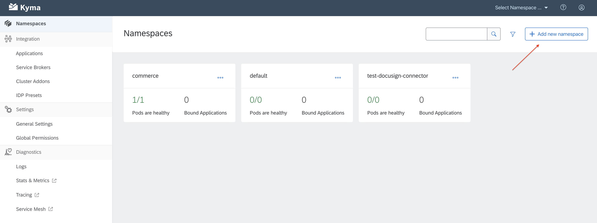
*
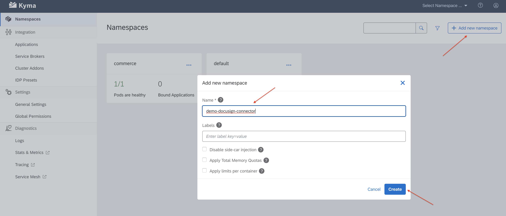
*
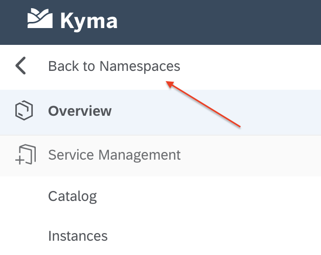
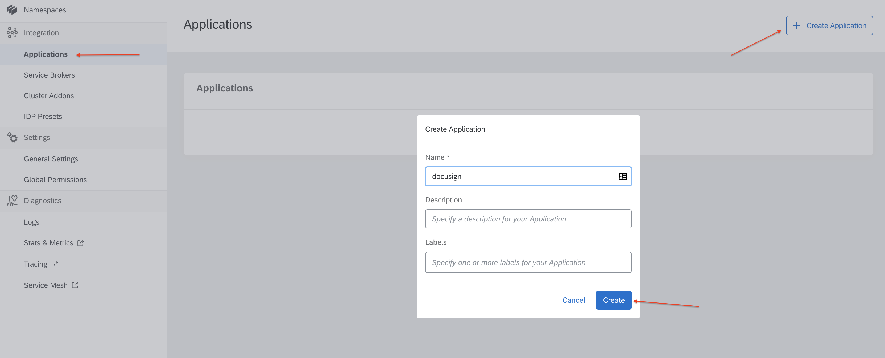
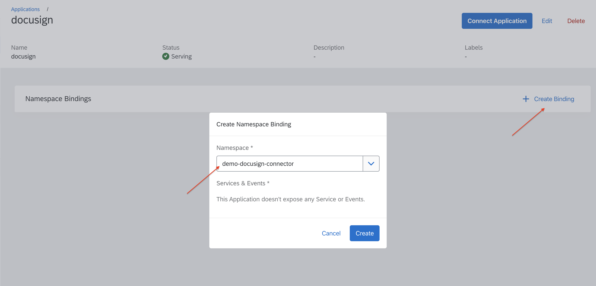
*
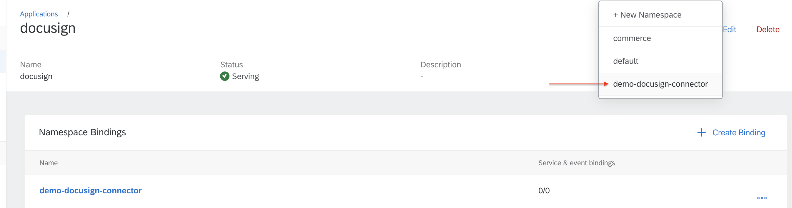
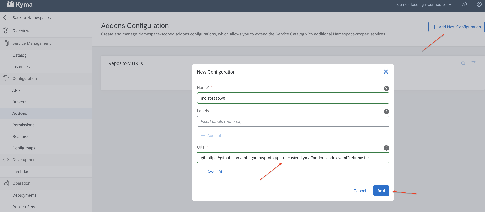
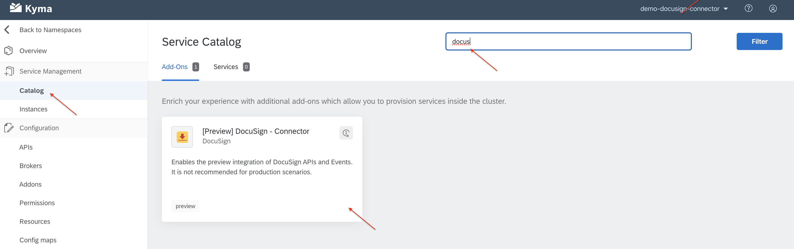
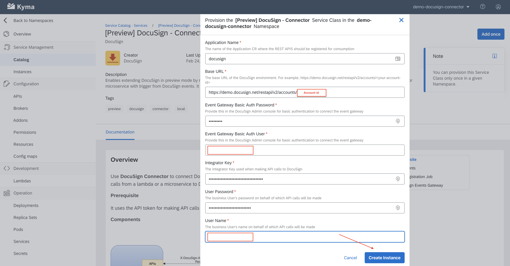
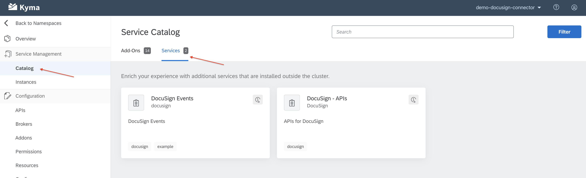
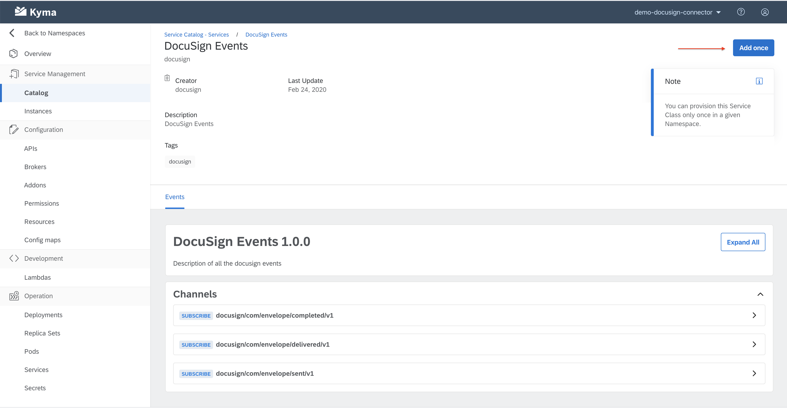
apis add once
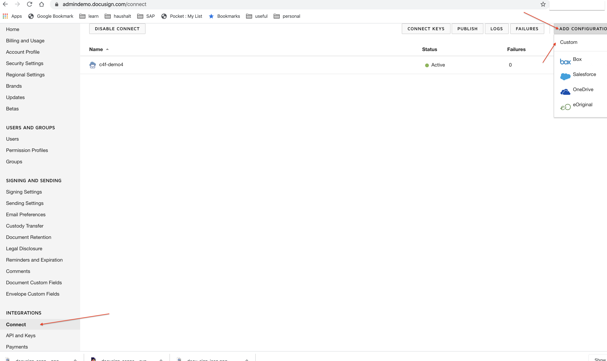
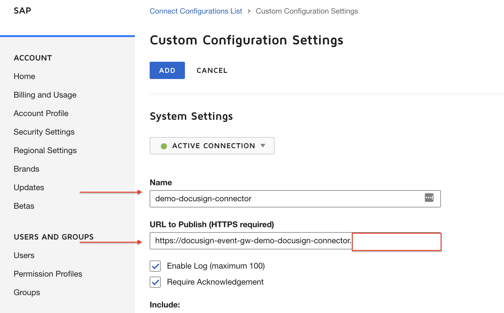
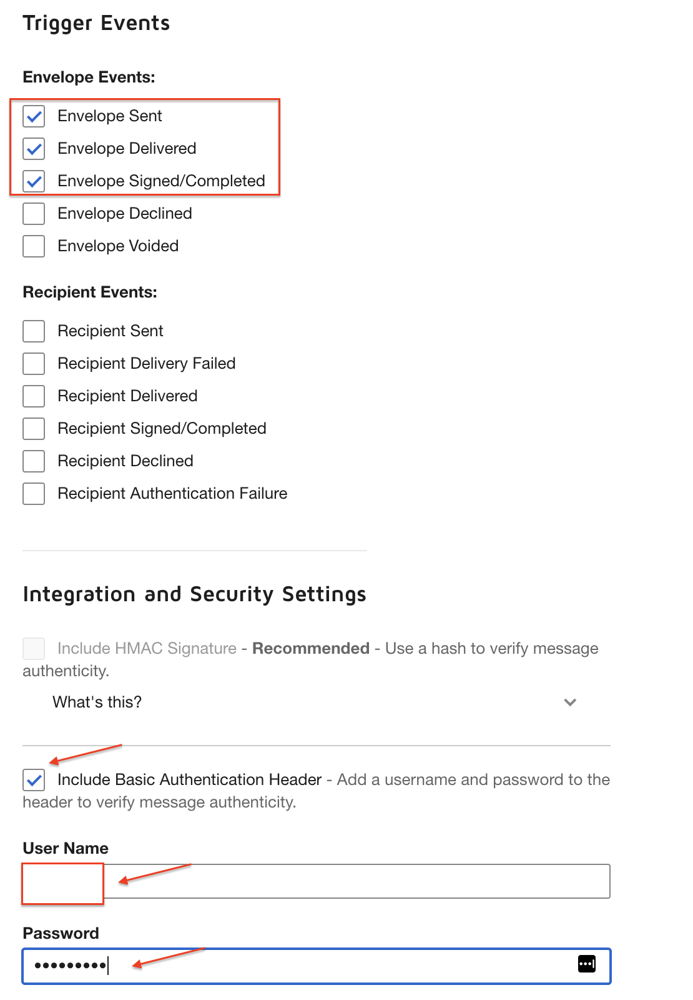
create lambda
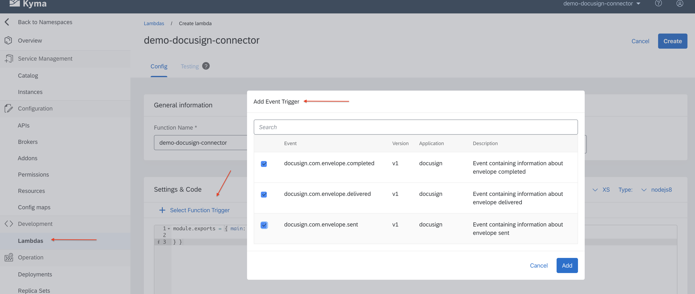
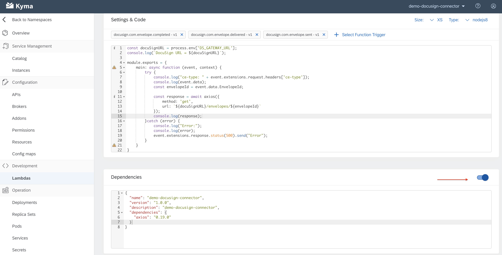
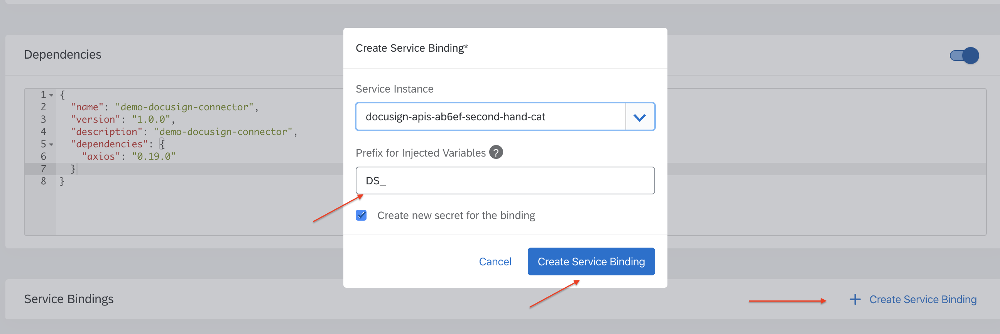
save lambda
create an envelope
check logs