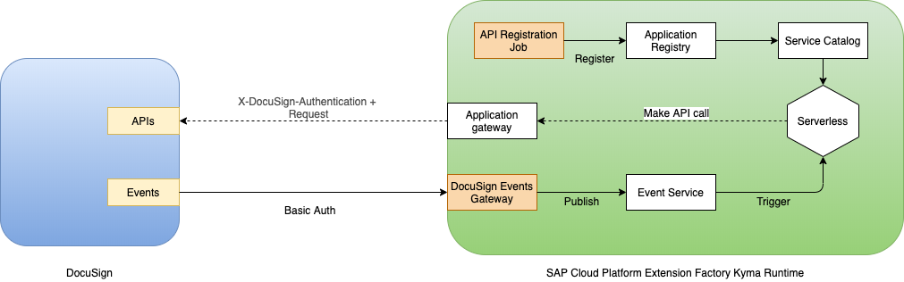

--
title: Overview
type: Overview
---

Use **DocuSign Connector** to connect DocuSign Events with Kyma events to trigger serverless compute and make API calls from a lambda or a microservice to DocuSign.

**Prerequisite**

It uses the API token for making API calls to DocuSign.

**Components**

